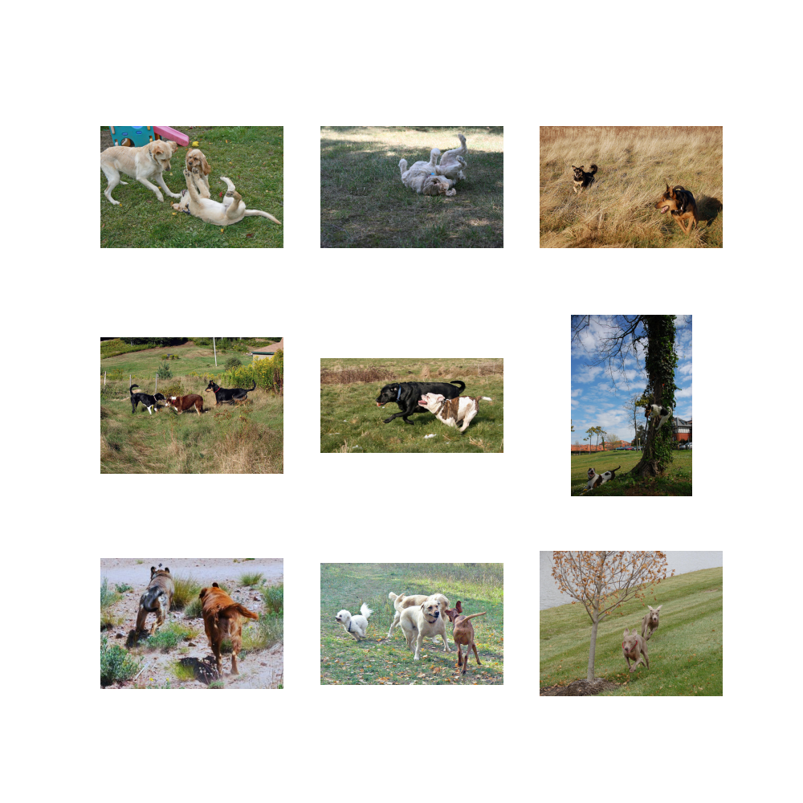

# clip-hindi
CLIP (Contrastive Language-Image Pre-training)  a vision-language model that connects images and text by learning a shared representation. The model is trained to understand and match images with their corresponding textual descriptions without relying on traditional supervised learning with labeled datasets. Instead, it leverages a large amount of image-text pairs from the web, which allows it to generalize well to new and unseen data.

In this case we used two pre-trained model to encode both images and texts:

1) l3cube-pune/hindi-bert-v2 from huggingface 
2) resnet50 from timm 

We also provide a notebook for finetuning the model 

# Examples 
This model takes in a text or a prompt like `घास पर कुत्ता` and then a bunch of images pass the images and prompt to the text encoder and image encoder computes the similarities and then tell us which images is the most similar based on the prompt 

<div style="text-align: center;">
  
</div>

# Hyper-parameters during training

| **Hyperparameter**      | **Value**                               |
|-------------------------|-----------------------------------------|
| batch_size            | 32                                    |
| num_workers           | 2                                     |
| head_lr               | 1e-3                                  |
| image_encoder_lr      | 1e-4                                  |
| text_encoder_lr       | 1e-5                                  |
| weight_decay          | 1e-3                                  |
| patience              | 1                                     |
| factor                | 0.8                                   |

# Get Started 

First you will have to git clone this repo 

```bash
!git clone https://github.com/dame-cell/clip-hindi.git
%cd  clip-hindi
!pip install -r requirements.txt
```

Then you wil have to download the pytorch model from huggingface

```python
from huggingface_hub import hf_hub_download
hf_hub_download(repo_id="damerajee/clip-hindi", filename="model.pt",local_dir="model")
```
You can then load the model  and the image as well 
```python 
import torch 
from clip.modeling_clip import CLIPModel
import matplotlib.pyplot as plt
from PIL import Image
import numpy as np
from transformers import AutoTokenizer 
import torch.nn.functional as F
import requests

model = CLIPModel().to("cuda")
model.load_state_dict(torch.load("where you stored you model.pt", map_location="cuda"))
tokenizer = AutoTokenizer.from_pretrained("l3cube-pune/hindi-bert-v2")

text_inputs = tokenizer([
    "एक बिल्ली की लेटी हुई तस्वीर",
    "एक कुत्ते की लेटी हुई तस्वीर",
], padding=True, truncation=True, return_tensors="pt")

url = "http://images.cocodataset.org/val2017/000000039769.jpg"
image = Image.open(requests.get(url, stream=True).raw)

cat_image = Image.fromarray(np.uint8(image))
image_np = np.array(image)  
preprocessor = model.preprocess()  
preprocessed = preprocessor(image=image_np)['image'] 

preprocessed_tensor = torch.tensor(preprocessed).float()
preprocessed_tensor = preprocessed_tensor.permute(2, 0, 1)  # Change shape to [C, H, W]
preprocessed_tensor = preprocessed_tensor.unsqueeze(0)

processed_image =preprocessed_tensor.to("cuda")
text_inputs = text_inputs.to("cuda")
```
and then you can try it out 
```python

image_features , text_features = model(processed_image,text_input_ids=text_inputs['input_ids'],text_attention_mask=text_inputs['attention_mask'])

# normalize the features 
image_embeddings_n = F.normalize(image_features, p=2, dim=-1)
text_embeddings_n = F.normalize(text_features, p=2, dim=-1)

# calculate the similarities 
dot_similarity = text_embeddings_n @ image_embeddings_n.T
print("dot_similarity",dot_similarity)

# output - > # output - > dot_similarity tensor([[0.0502],[0.0465]], grad_fn=<MmBackward0>)
```

# Limitations 
The model was just trained on the flicker9k captions for 10 epochs so it is not that good 

will be training on larger dataset 

# Reference 

```bibtex
@software{Shariatnia_Simple_CLIP_2021,
author = {Shariatnia, M. Moein},
doi = {10.5281/zenodo.6845731},
month = {4},
title = {{Simple CLIP}},
version = {1.0.0},
year = {2021}
}
```
